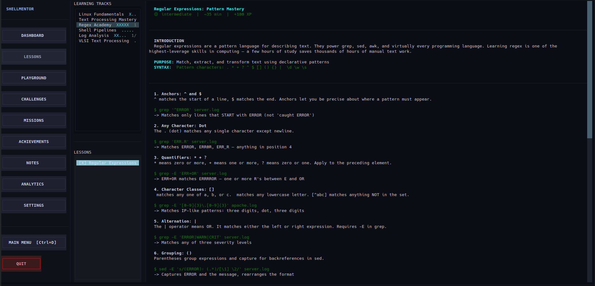
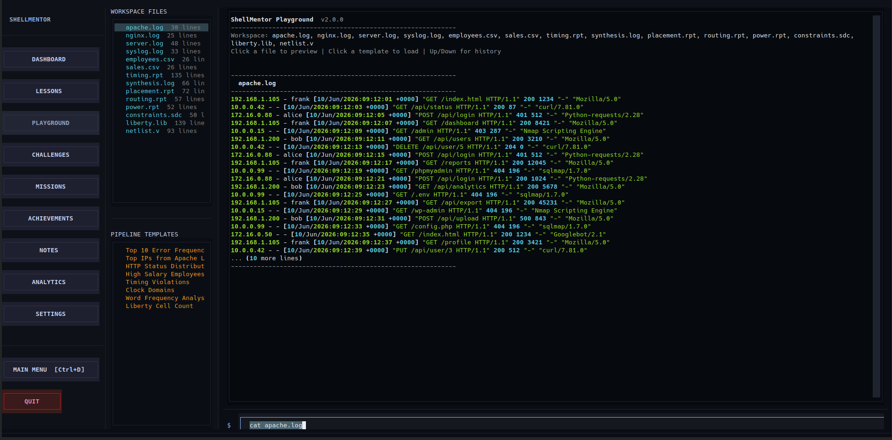
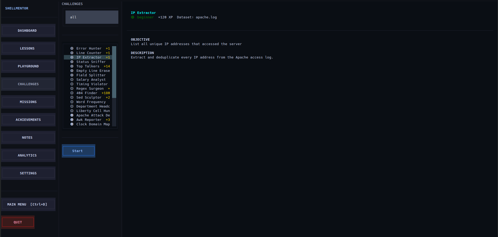
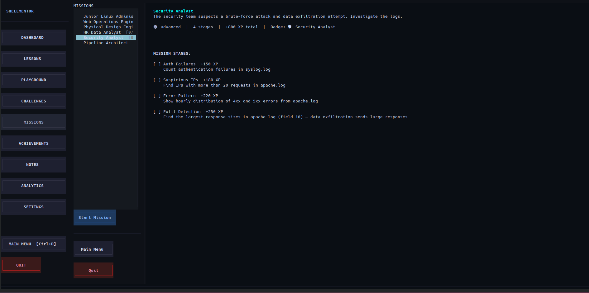
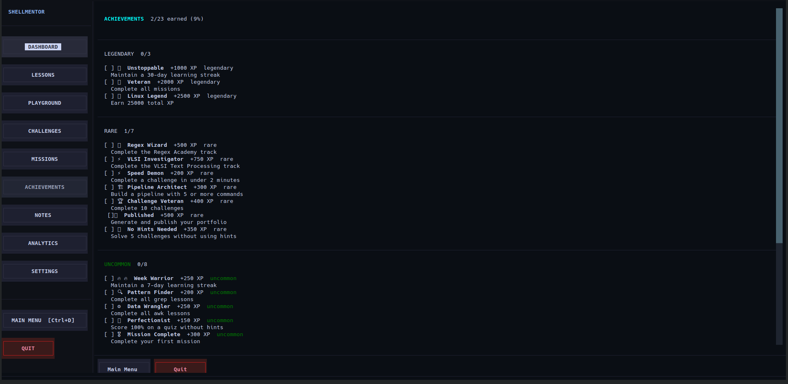
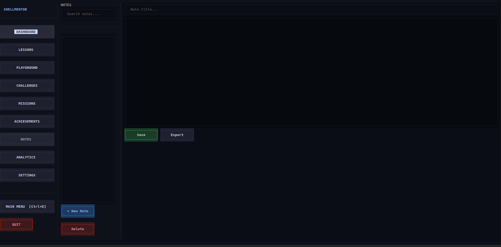
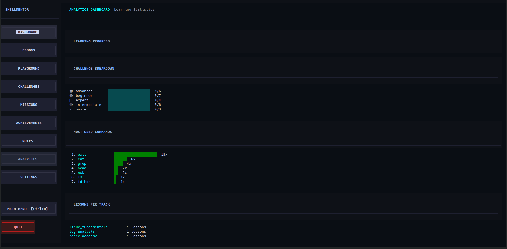
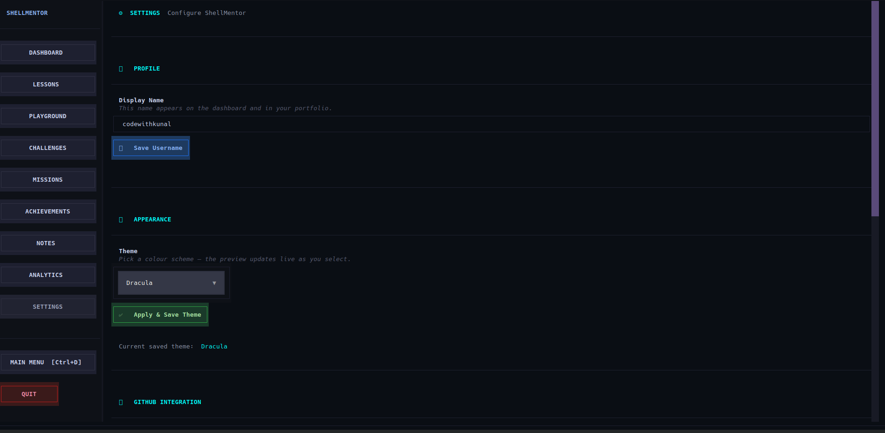

# ShellMentor

A professional-grade, interactive terminal-based learning platform for mastering Linux command-line proficiency through structured lessons, practical challenges, and gamified progression tracking.

## Table of Contents

- [Overview](#overview)
- [Key Features](#key-features)
- [System Requirements](#system-requirements)
- [Installation](#installation)
- [Quick Start Guide](#quick-start-guide)
- [Architecture and Design](#architecture-and-design)
- [Module Documentation](#module-documentation)
- [Learning Curriculum](#learning-curriculum)
- [Configuration](#configuration)
- [Advanced Usage](#advanced-usage)
- [API Reference](#api-reference)
- [Project Roadmap](#project-roadmap)
- [License](#license)
- [Support](#support)

---

## Overview

ShellMentor is an enterprise-ready, terminal-based educational platform designed to facilitate comprehensive Linux command-line skill development. Built with Python 3.10+ and powered by the Textual framework, ShellMentor provides an immersive learning environment that combines structured curriculum delivery with gamification mechanics to maintain user engagement and track progress systematically.

The platform serves multiple user personas: from novice system administrators learning fundamental command syntax, to experienced DevOps engineers refining their shell scripting proficiency, to VLSI professionals integrating command-line workflows into their technical domain.

### Target Audience

- Linux system administrators and DevOps engineers
- Software developers seeking shell scripting mastery
- System performance analysts and site reliability engineers
- VLSI and EDA professionals requiring specialized command-line workflows
- Educational institutions delivering Linux fundamentals courses
- Self-directed learners pursuing command-line proficiency

### Core Value Proposition

ShellMentor eliminates the fragmentation of Linux learning by providing an integrated ecosystem that combines:

1. Structured, progressive lesson material
2. Practical, hands-on exercise environments
3. Challenge-based skill validation
4. Comprehensive progress tracking and analytics
5. Achievement-based motivation and gamification
6. Persistent user state and learning history

---

## Screenshots

> All screenshots are taken from ShellMentor v4.1.0 running on Linux.

### Lessons — Structured Curriculum Delivery

Interactive lesson content with syntax-highlighted examples and inline command walkthroughs.



---

### Playground — Live Command Practice Environment

Workspace files, real datasets, and a pipeline-ready terminal for hands-on experimentation.



---

### Challenges — Skill Validation Exercises

Browse and launch scored challenges across difficulty tiers, each mapped to real-world scenarios.



---

### Missions — Multi-Stage Learning Objectives

Complex, narrative-framed missions that chain multiple skills into cohesive workflows.



---

### Achievements — Gamification & Badges

Tiered achievement system (Legendary, Rare, Uncommon, Common) with XP rewards and unlock criteria.



---

### Notes — Personal Knowledge Repository

In-app notepad with search, save, and export functionality for capturing command learnings.



---

### Analytics — Learning Statistics Dashboard

Progress breakdowns by challenge difficulty, most-used commands, and lessons per track.



---

### Settings — Profile & Theme Configuration

Username management, theme selection (Dracula, and more), and application settings.



---

## Key Features

### Interactive Learning Environment

ShellMentor implements a multi-modal learning experience designed for knowledge retention and practical skill development:

- **Structured Lessons**: Sequenced learning modules that build conceptual understanding from fundamentals to advanced topics
- **Progressive Pathways**: Adaptive learning tracks that adjust complexity based on user proficiency assessment
- **Guided Exercises**: Step-by-step command demonstrations with real-time feedback
- **Contextual Examples**: Domain-specific use cases including VLSI workflows, data analysis, and system administration scenarios
- **Integrated Documentation**: Searchable reference material embedded within the application

### Command Practice Environment

The dedicated practice environment provides users with realistic scenarios and datasets for command experimentation:

- **Sandbox Execution**: Isolated command execution preventing unintended system modifications
- **Real Datasets**: Production-grade sample datasets including CSV files, configuration files, and engineering documents
- **Pipeline Experimentation**: Safe environment for constructing and testing complex command pipelines
- **Output Visualization**: Rich terminal output rendering with syntax highlighting and formatting

### Skill Validation Through Challenges

Challenges implement scenario-based problem-solving to validate acquired skills:

- **Real-World Scenarios**: Challenge problems derived from actual system administration and data processing tasks
- **Progressive Difficulty**: Challenge ranking from beginner to expert levels with clearly defined success criteria
- **Instant Feedback**: Automated validation of command outputs against expected results
- **Solution Analytics**: Detailed performance metrics and alternative solution paths

### Mission-Based Learning

Missions aggregate multiple skills into cohesive learning objectives:

- **Multi-Step Workflows**: Complex tasks requiring integration of multiple command-line concepts
- **Narrative Context**: Mission scenarios presented with meaningful narrative framing
- **State Persistence**: Mission progress saved with ability to resume from checkpoints
- **Reward Integration**: Direct connection between mission completion and achievement system

### Comprehensive Progress Tracking

ShellMentor implements sophisticated progress tracking mechanisms:

- **Experience Point System**: Quantified skill progression through XP accumulation
- **Leveling System**: Milestone-based advancement with associated achievements and unlocks
- **Learning Analytics**: Detailed statistics on lesson completion, challenge success rates, and time investment
- **Streak Tracking**: Consecutive daily engagement metrics to encourage consistent learning habits
- **Achievement Repository**: Categorized accomplishments with descriptive narratives and difficulty classifications

### Gamification Framework

Intrinsic motivation mechanics drive long-term user engagement:

- **Achievement Unlocking**: Milestone-based rewards for specific accomplishments
- **Leaderboard Integration**: Optional community-facing progress comparison
- **Skill Badges**: Visual representation of acquired competencies
- **Challenge Progressions**: Ranked challenges with increasing difficulty and reward
- **Daily Streaks**: Engagement tracking with notifications for consistency rewards

### Multi-Platform Learning Modes

ShellMentor provides specialized learning environments for different objectives:

- **Lessons Module**: Structured curriculum delivery with comprehension checkpoints
- **Playground Module**: Freeform command execution and pipeline experimentation
- **Challenges Module**: Scored problem-solving exercises with success validation
- **Missions Module**: Complex, narrative-driven learning objectives
- **Analytics Dashboard**: Comprehensive progress visualization and performance metrics

---

## System Requirements

### Operating System Compatibility

| Operating System | Status | Notes |
|------------------|--------|-------|
| Linux (Ubuntu) | Fully Supported | Primary development and testing target |
| Linux (Debian) | Fully Supported | Compatible with tested configuration |
| Linux (Fedora) | Fully Supported | Compatible with tested configuration |
| Linux (Mint) | Fully Supported | Compatible with tested configuration |
| Linux (Generic) | Supported | Requires POSIX-compliant shell |
| macOS | Partial Support | Requires additional configuration |
| Windows 11 (WSL2) | Partial Support | Windows Subsystem for Linux required |

### Software Dependencies

| Component | Version | Purpose |
|-----------|---------|---------|
| Python | 3.10+ | Core runtime environment |
| pip | 21.0+ | Package management |
| Terminal Emulator | Modern | Rich TUI rendering |
| Git | 2.0+ | Version control integration |

### Hardware Recommendations

| Specification | Minimum | Recommended |
|--------------|---------|------------|
| CPU | Single Core | Dual Core |
| RAM | 512 MB | 2 GB |
| Storage | 500 MB | 2 GB |
| Terminal Width | 80 columns | 120+ columns |
| Terminal Height | 24 rows | 30+ rows |

### Dependency Specifications

```
Python 3.10+
textual>=0.30.0          # Rich terminal UI framework
rich>=13.0.0             # Terminal formatting and rendering
pyyaml>=6.0              # Configuration file parsing
click>=8.1.0             # Command-line interface library
```

---

## Installation

### Prerequisites Verification

Before beginning installation, verify system compatibility:

```bash
# Check Python version
python3 --version
# Expected: Python 3.10 or higher

# Check pip availability
pip3 --version
# Expected: pip 21.0 or higher

# Verify git installation
git --version
# Expected: git 2.0 or higher
```

### Standard Installation (Recommended)

Follow this procedure for standard development installation:

#### Step 1: Clone Repository

```bash
git clone https://github.com/bitWithKunal/ShellMentor.git
cd ShellMentor
```

#### Step 2: Create Isolated Python Environment

```bash
# Create virtual environment
python3 -m venv .venv

# Activate virtual environment
# On Linux/macOS:
source .venv/bin/activate

# On Windows (WSL2):
source .venv/bin/activate
```

#### Step 3: Install Dependencies

```bash
# Upgrade pip, setuptools, wheel
pip install --upgrade pip setuptools wheel

# Install project dependencies
pip install -r requirements.txt
```

#### Step 4: Launch Application

```bash
# Start ShellMentor
python main.py
```

### Alternative: Using Installation Script

For convenience, an automated launcher script is provided:

```bash
# Make script executable
chmod +x shellmentor.sh

# Execute launcher
./shellmentor.sh
```

### Docker Installation (Optional)

For containerized deployment:

```bash
# Build Docker image
docker build -t shellmentor:latest .

# Run in container
docker run -it --rm shellmentor:latest python main.py
```

### Verification Installation

After installation, verify correct operation:

```bash
# Check dependencies are loaded
python -c "import textual; import rich; print('OK')"

# Launch help
python main.py --help
```

---

## Quick Start Guide

### First Launch

Upon first execution, ShellMentor performs initial setup:

```bash
cd ShellMentor
source .venv/bin/activate
python main.py
```

Expected first-run sequence:

1. Environment scan displays system information
2. Dashboard initializes with welcome message
3. Tutorial prompt appears for first-time users
4. Command palette available via Ctrl+P

### Primary Navigation

The application implements a command palette for rapid navigation:

| Keyboard Shortcut | Action | Description |
|-------------------|--------|-------------|
| Ctrl+P | Command Palette | Open searchable command menu |
| Ctrl+D | Dashboard | Return to main dashboard |
| Ctrl+L | Lessons | Navigate to lesson module |
| Ctrl+G | Playground | Open command practice environment |
| Ctrl+H | Challenges | Access challenge problems |
| Ctrl+M | Missions | Open mission learning sequences |
| Ctrl+A | Achievements | View achievement repository |
| Ctrl+N | Notes | Access personal notes |
| Ctrl+R | Analytics | Display progress analytics |
| Ctrl+S | Settings | Open application settings |
| Ctrl+Q | Quit | Exit application |

### Essential First Steps

1. **Review Dashboard**: Understand current progress and available modules
2. **Start Lesson 1**: Begin structured curriculum from fundamentals
3. **Try Playground**: Experiment with basic commands in safe environment
4. **Complete First Challenge**: Validate understanding with problem solving
5. **Check Analytics**: Review progress and identify areas for focus

---

## Architecture and Design

### High-Level System Architecture

```
ShellMentor Application Architecture
====================================

┌─────────────────────────────────────────────────────┐
│                  User Interface Layer               │
│         (Textual TUI Framework - ui.py)            │
├─────────────────────────────────────────────────────┤
│  Dashboard | Lessons | Playground | Challenges     │
│  Missions  | Analytics | Settings | Achievements   │
├─────────────────────────────────────────────────────┤
│              Business Logic Layer                   │
├─────────────────────────────────────────────────────┤
│  LearningEngine | ChallengeEngine | PlaygroundEngine│
│  ProgressEngine | MissionEngine   | AchievementEngine
├─────────────────────────────────────────────────────┤
│              Data Persistence Layer                 │
│          (DataManager - data_manager.py)            │
├─────────────────────────────────────────────────────┤
│  JSON File Storage | User Progress | Configuration │
├─────────────────────────────────────────────────────┤
│            Integration Layer                        │
├─────────────────────────────────────────────────────┤
│  System Command Execution | Sandbox  │
└─────────────────────────────────────────────────────┘
```

### Module Responsibilities

ShellMentor implements a modular architecture with well-defined separation of concerns:

#### main.py - Application Entry Point
- Application initialization and bootstrap
- Global keyboard binding configuration
- Screen stack management
- Event-driven architecture coordination
- Graceful shutdown handling

#### ui.py - User Interface Layers
- Textual screen implementations for all modules
- Rich TUI component rendering
- Modal and dialog implementations
- Input validation and user feedback
- Responsive layout management

#### data_manager.py - Data Persistence
- JSON file-based data storage
- User progress serialization
- Configuration management
- Atomic file write operations
- Data validation and integrity checking

#### learning.py - Curriculum Engine
- Lesson content loading and sequencing
- Progress state management per lesson
- Comprehension checkpoint validation
- Learning path progression logic

#### challenge.py - Challenge Validation Engine
- Challenge specification parsing
- Command execution and validation
- Output comparison algorithms
- Success criteria evaluation
- Solution history tracking

#### playground.py - Practice Environment
- Isolated command execution environment
- Real-time output rendering
- Pipeline construction support
- History and session management
- Dataset reference provision

#### progress.py - Gamification Framework
- Experience point calculation and tracking
- Level and milestone progression
- Achievement unlock logic
- Streak calculation and maintenance
- Analytics aggregation and reporting

#### utils.py - Shared Utilities
- System detection and configuration
- File path resolution
- Data formatting and conversion
- Environment variable handling
- Logging and debugging utilities

#### utils.py - Shared Utilities

#### User Progress Entity

```json
{
  "user_id": "uuid",
  "username": "string",
  "level": "integer",
  "total_xp": "integer",
  "current_xp": "integer",
  "streak_days": "integer",
  "last_activity": "timestamp",
  "lessons_completed": ["lesson_id"],
  "challenges_completed": ["challenge_id"],
  "achievements_unlocked": ["achievement_id"],
  "notes": ["note_object"]
}
```

#### Challenge Entity

```json
{
  "id": "string",
  "title": "string",
  "description": "string",
  "difficulty": "beginner|intermediate|advanced",
  "topic": "string",
  "setup_commands": ["string"],
  "test_command": "string",
  "expected_output": "string",
  "hints": ["string"],
  "xp_reward": "integer"
}
```

#### Achievement Entity

```json
{
  "id": "string",
  "title": "string",
  "description": "string",
  "category": "string",
  "unlock_condition": "string",
  "rarity": "common|uncommon|rare|epic|legendary"
}
```

---

## Module Documentation

### LearningEngine

The LearningEngine manages structured curriculum delivery and progress tracking through lessons.

#### Core Methods

```python
def load_lesson(lesson_id: str) -> Lesson:
    """Load lesson content and metadata from data store."""

def get_current_progress(user_id: str) -> LessonProgress:
    """Retrieve current user progress for active lesson."""

def advance_lesson(user_id: str, lesson_id: str) -> bool:
    """Mark lesson as completed and advance progression."""

def get_lesson_list() -> list[Lesson]:
    """Return all available lessons ordered by sequence."""
```

#### Usage Example

```python
learning_engine = LearningEngine(data_manager)
lesson = learning_engine.load_lesson("lesson_001")
progress = learning_engine.get_current_progress(user_id)
completed = learning_engine.advance_lesson(user_id, "lesson_001")
```

### ChallengeEngine

The ChallengeEngine validates command execution against challenge success criteria.

#### Core Methods

```python
def get_challenge(challenge_id: str) -> Challenge:
    """Retrieve challenge specification and metadata."""

def validate_solution(challenge_id: str, user_command: str) -> ValidationResult:
    """Execute user command and validate against expected output."""

def get_hint(challenge_id: str) -> str:
    """Retrieve next hint for challenge."""

def submit_solution(user_id: str, challenge_id: str) -> SolutionResult:
    """Submit solution and process completion."""
```

#### Usage Example

```python
challenge_engine = ChallengeEngine(data_manager)
challenge = challenge_engine.get_challenge("challenge_005")
result = challenge_engine.validate_solution("challenge_005", "grep 'pattern' file.txt")
if result.success:
    challenge_engine.submit_solution(user_id, "challenge_005")
```

### PlaygroundEngine

The PlaygroundEngine provides an isolated environment for command experimentation.

#### Core Methods

```python
def execute_command(command: str) -> ExecutionResult:
    """Execute command in isolated sandbox environment."""

def get_available_datasets() -> list[Dataset]:
    """Return list of available practice datasets."""

def get_command_history(limit: int = 50) -> list[CommandHistory]:
    """Retrieve historical command execution."""

def clear_environment() -> None:
    """Reset playground state to initial configuration."""
```

#### Usage Example

```python
playground_engine = PlaygroundEngine(data_manager)
result = playground_engine.execute_command("ls -la")
datasets = playground_engine.get_available_datasets()
history = playground_engine.get_command_history(limit=20)
```

### ProgressEngine

The ProgressEngine manages XP accumulation, achievement unlocking, and gamification metrics.

#### Core Methods

```python
def award_xp(user_id: str, xp_amount: int, source: str) -> None:
    """Award experience points for user activity."""

def check_level_up(user_id: str) -> LevelUpEvent | None:
    """Verify level threshold achievement and return event if triggered."""

def unlock_achievement(user_id: str, achievement_id: str) -> AchievementUnlockEvent:
    """Unlock specified achievement for user."""

def get_progress_summary(user_id: str) -> ProgressSummary:
    """Return comprehensive progress statistics."""
```

#### Usage Example

```python
progress_engine = ProgressEngine(data_manager)
progress_engine.award_xp(user_id, 100, source="challenge_completion")
levelup = progress_engine.check_level_up(user_id)
if levelup:
    print(f"Level up to {levelup.new_level}")
```

---

## Learning Curriculum

### Curriculum Structure

ShellMentor implements a sequential, progressive curriculum designed for incremental skill building:

#### Foundation Track (Lessons 1-10)

**Objective**: Establish fundamental Linux command-line literacy

1. **Lesson 1: Terminal Fundamentals**
   - Terminal emulator overview
   - Command syntax basics
   - Shell prompt interpretation
   - Input/output concepts
   - Exit status codes

2. **Lesson 2: File System Navigation**
   - Directory structure understanding
   - pwd, cd, ls commands
   - Path concepts (absolute/relative)
   - Hidden files and directories
   - Current working directory

3. **Lesson 3: File and Directory Operations**
   - File creation and deletion
   - Directory creation and removal
   - cp, mv, rm operations
   - File permissions overview
   - Directory traversal

4. **Lesson 4: File Viewing and Manipulation**
   - cat, less, more commands
   - File content display techniques
   - Text file navigation
   - Output redirection basics
   - File comparison tools

5. **Lesson 5: Permissions and Ownership**
   - Permission model (rwx)
   - Numeric and symbolic notation
   - chmod operation
   - chown and chgrp commands
   - User and group concepts

6. **Lesson 6: Process Management**
   - Process listing and inspection
   - ps command variations
   - Process killing and signals
   - Background and foreground execution
   - Job control

7. **Lesson 7: Shell Basics**
   - Shell types and features
   - Environment variables
   - Shell expansion mechanisms
   - Command substitution
   - Quoting and escaping

8. **Lesson 8: Basic Piping and Redirection**
   - pipe (|) operator
   - Input redirection (<)
   - Output redirection (>, >>)
   - Error stream redirection
   - Stream combination

9. **Lesson 9: Introduction to grep**
   - grep command fundamentals
   - Pattern matching basics
   - Regular expression introduction
   - grep options and flags
   - Practical use cases

10. **Lesson 10: Introduction to sed**
    - Stream editor basics
    - Substitution operations
    - Address ranges
    - sed flags and modifiers
    - Practical text transformation

#### Intermediate Track (Lessons 11-20)

**Objective**: Develop practical proficiency in text processing and data manipulation

11. **Lesson 11: Advanced grep**
    - Extended regular expressions
    - Context options
    - Color output and formatting
    - Performance considerations
    - Complex pattern construction

12. **Lesson 12: sed Deep Dive**
    - Hold space and pattern space
    - Advanced substitutions
    - Multi-line operations
    - Script files and batch operations
    - Performance optimization

13. **Lesson 13: awk Fundamentals**
    - awk structure and flow
    - Field processing and variables
    - Patterns and actions
    - Arithmetic and string operations
    - Built-in functions

14. **Lesson 14: awk Advanced Operations**
    - Associative arrays
    - User-defined functions
    - Flow control constructs
    - Regular expressions in awk
    - Complex data processing

15. **Lesson 15: sort and cut Commands**
    - sort algorithm and options
    - sort key specification
    - cut field selection
    - Delimiter handling
    - Performance characteristics

16. **Lesson 16: uniq and paste Operations**
    - uniq filtering and counting
    - paste command line combining
    - Duplicate removal strategies
    - Column operations
    - Data merging techniques

17. **Lesson 17: find Command Mastery**
    - find syntax and predicates
    - Name-based searching
    - Type and permission filtering
    - Time-based selection
    - Action execution

18. **Lesson 18: xargs and Command Construction**
    - xargs syntax and options
    - Input delimiter specification
    - Command substitution alternatives
    - Parallel execution
    - Performance optimization

19. **Lesson 19: Regular Expressions Deep Dive**
    - Basic and extended syntax
    - Character classes and ranges
    - Quantifiers and anchors
    - Grouping and alternation
    - Backreferences and lookarounds

20. **Lesson 20: Complex Pipeline Construction**
    - Multi-stage pipeline design
    - Data transformation workflows
    - Performance considerations
    - Debugging pipeline issues
    - Real-world scenarios

#### Advanced Track (Lessons 21+)

**Objective**: Attain expert-level command-line proficiency

21. **Lesson 21: Shell Scripting Fundamentals**
    - Shebang and execution
    - Variable declaration and scope
    - Control flow structures
    - Function definition and invocation
    - Script debugging

22. **Lesson 22: Advanced Shell Features**
    - Conditional execution
    - Loop constructs and patterns
    - Array operations
    - String manipulation
    - Arithmetic operations

23. **Lesson 23: Command-Line Data Analysis**
    - Statistical calculations
    - Data extraction and transformation
    - Report generation
    - Data validation
    - CSV/TSV processing

24. **Lesson 24: System Administration Workflows**
    - Log file analysis
    - User and group management
    - System monitoring techniques
    - Batch file operations
    - Automation patterns

25. **Lesson 25: VLSI and EDA Command-Line Workflows**
    - Liberty file processing
    - Netlist manipulation
    - Timing report analysis
    - Constraint file handling
    - Engineering data integration

### Challenge Progression

Challenges are organized by topic and difficulty level:

#### Beginner Challenges (1-10 XP)
- Basic file operations
- Simple grep patterns
- Elementary sed substitutions
- Directory navigation
- Permission modifications

#### Intermediate Challenges (10-25 XP)
- Complex pipeline construction
- awk data processing
- Advanced sed operations
- find command scenarios
- Data extraction problems

#### Advanced Challenges (25-50 XP)
- Multi-stage data transformation
- Real-world system administration tasks
- Performance optimization problems
- Engineering workflow scenarios
- Integration testing exercises

### Mission Framework

Missions provide narrative-driven, multi-step learning objectives that integrate multiple concepts:

#### Mission Types

1. **Data Processing Missions**: Multi-stage data transformation workflows
2. **System Administration Missions**: Real-world operational scenarios
3. **Performance Analysis Missions**: Optimization and benchmarking tasks
4. **Engineering Workflow Missions**: VLSI-specific integrated exercises

---

## Configuration

### Configuration Files

ShellMentor uses YAML and JSON for configuration:

#### themes.yaml - Visual Theming

```yaml
default_theme:
  name: "Catppuccin"
  colors:
    background: "#0a0e14"
    foreground: "#cdd6f4"
    primary: "#89b4fa"
    accent: "#f38ba8"
    success: "#a6e3a1"
    warning: "#f9e2af"
    error: "#f38ba8"
```

#### config.json - Application Settings

```json
{
  "application": {
    "name": "ShellMentor",
    "version": "1.0.0",
    "debug": false
  },
  "learning": {
    "autosave_interval": 30,
    "checkpoint_enabled": true,
    "hint_penalty": 10
  },
  "gamification": {
    "xp_per_lesson": 50,
    "xp_per_challenge": 100,
    "xp_per_mission": 250,
    "level_threshold": 1000
  },
  "execution": {
    "command_timeout": 30,
    "sandbox_enabled": true
  }
}
```

### Environment Variables

ShellMentor respects standard environment variables:

```bash
# Logging configuration
export SHELLMENTOR_LOG_LEVEL=INFO
export SHELLMENTOR_LOG_FILE=~/.shellmentor.log

# Feature flags
export SHELLMENTOR_DEBUG=false

# Data paths
export SHELLMENTOR_DATA_DIR=~/.shellmentor/data

# Theme configuration
export SHELLMENTOR_THEME=catppuccin
```

---

## Advanced Usage

### Custom Lesson Creation

Create custom lessons by extending the lessons.json format:

```json
{
  "id": "custom_001",
  "title": "Custom Lesson Title",
  "description": "Detailed lesson description",
  "difficulty": "intermediate",
  "prerequisites": ["lesson_010", "lesson_015"],
  "content": {
    "introduction": "Lesson introduction text",
    "concepts": [
      {
        "title": "Concept Name",
        "explanation": "Detailed explanation",
        "examples": ["example 1", "example 2"]
      }
    ],
    "exercises": [
      {
        "type": "guided",
        "instruction": "Exercise instruction",
        "command": "example_command",
        "expected_output": "pattern"
      }
    ]
  },
  "xp_reward": 50
}
```

### Custom Challenge Creation

Define custom challenges with validation logic:

```json
{
  "id": "custom_challenge_001",
  "title": "Challenge Title",
  "description": "Challenge description",
  "difficulty": "advanced",
  "topic": "text_processing",
  "setup_commands": [
    "mkdir -p /tmp/challenge",
    "cd /tmp/challenge"
  ],
  "test_command": "cat data.txt | your_command_here",
  "expected_output": "^pattern_to_match$",
  "hints": [
    "Hint 1",
    "Hint 2",
    "Hint 3"
  ],
  "xp_reward": 100,
  "alternative_solutions": [
    "alternative_command_1",
    "alternative_command_2"
  ]
}
```

### Programmatic Data Access

Access ShellMentor data programmatically:

```python
from data_manager import DataManager
from learning import LearningEngine
from progress import ProgressEngine

# Initialize managers
dm = DataManager()
learning = LearningEngine(dm)
progress = ProgressEngine(dm)

# Retrieve user progress
user_progress = dm.get_progress()
print(f"Current Level: {user_progress['level']}")
print(f"Total XP: {user_progress['total_xp']}")

# Export statistics
stats = progress.get_progress_summary(user_id="default")
print(stats)

# Backup user data
dm.export_progress("backup.json")
```

### Analytics and Reporting

Generate detailed analytics reports:

```python
from progress import ProgressEngine

progress_engine = ProgressEngine(data_manager)
summary = progress_engine.get_progress_summary(user_id)

print(f"Lessons Completed: {summary['lessons_completed']}")
print(f"Challenges Passed: {summary['challenges_passed']}")
print(f"Average Challenge Completion Time: {summary['avg_challenge_time']}")
print(f"Learning Streak: {summary['current_streak']} days")
print(f"Topics Mastered: {summary['mastered_topics']}")
```

---

## API Reference

### DataManager Class

```python
class DataManager:
    def load_lessons() -> list[dict]
    def load_challenges() -> list[dict]
    def load_missions() -> list[dict]
    def load_achievements() -> list[dict]
    
    def get_progress() -> dict
    def update_progress(progress_data: dict) -> None
    def save_progress() -> None
    
    def add_note(title: str, content: str) -> None
    def get_notes() -> list[dict]
    
    def export_progress(filepath: str) -> None
    def import_progress(filepath: str) -> None
    
    def close() -> None
```

### LearningEngine Class

```python
class LearningEngine:
    def load_lesson(lesson_id: str) -> dict
    def get_current_progress(user_id: str) -> dict
    def advance_lesson(user_id: str, lesson_id: str) -> bool
    def get_lesson_list() -> list[dict]
    def calculate_completion_percentage() -> float
```

### ChallengeEngine Class

```python
class ChallengeEngine:
    def get_challenge(challenge_id: str) -> dict
    def validate_solution(challenge_id: str, user_command: str) -> dict
    def get_hint(challenge_id: str) -> str
    def submit_solution(user_id: str, challenge_id: str) -> dict
    def get_challenges_by_topic(topic: str) -> list[dict]
```

### PlaygroundEngine Class

```python
class PlaygroundEngine:
    def execute_command(command: str) -> dict
    def get_available_datasets() -> list[dict]
    def get_command_history(limit: int) -> list[dict]
    def clear_environment() -> None
    def save_session(session_name: str) -> None
```

### ProgressEngine Class

```python
class ProgressEngine:
    def award_xp(user_id: str, xp_amount: int, source: str) -> None
    def check_level_up(user_id: str) -> dict | None
    def unlock_achievement(user_id: str, achievement_id: str) -> dict
    def get_progress_summary(user_id: str) -> dict
    def update_streak(user_id: str) -> None
    def generate_portfolio() -> tuple[str, str]
```


## Contributing

### Contribution Philosophy

ShellMentor welcomes contributions from the community. All contributions should align with the project's vision of providing professional-grade Linux education.

### Development Setup

#### Clone and Environment Setup

```bash
git clone https://github.com/bitWithKunal/ShellMentor.git
cd ShellMentor

# Create development virtual environment
python3 -m venv .venv
source .venv/bin/activate

# Install development dependencies
pip install -r requirements.txt
pip install pytest pytest-cov black flake8 mypy
```


Commit message guidelines:
- First line: Present tense, descriptive summary
- Blank line
- Detailed explanation of changes
- Reference related issues
- Explain reasoning and trade-offs

#### Step 5: Push and Create Pull Request

```bash
# Push feature branch
git push origin feature/descriptive-feature-name

# Create Pull Request on GitHub
# Provide:
# - Clear title summarizing changes
# - Description of modifications
# - Rationale for changes
# - Testing performed
# - Screenshots/examples if applicable
```

### Contribution Categories

#### Code Contributions

Priority areas for code contributions:
- Additional lesson content
- Challenge problem creation
- Performance optimization
- Test coverage expansion
- Bug fixes and error handling

#### Documentation Contributions

Documentation improvements welcome:
- API documentation expansion
- Tutorial creation
- Configuration guides
- Troubleshooting resources
- Architecture documentation

#### Content Contributions

Curriculum expansion:
- New lesson topics
- Challenge problems
- Mission scenarios
- VLSI workflow examples
- Domain-specific content

### Pull Request Review Process

All pull requests undergo review:

1. **Automated Checks**: Code quality, tests, linting
2. **Maintainer Review**: Functionality, design, documentation
3. **Community Feedback**: Discussion and suggestions
4. **Revision Cycle**: Address feedback and resubmit
5. **Merge**: Upon approval by maintainers

---

## Project Roadmap

### Version 1.0 (Current)

- Interactive lesson framework
- Challenge validation engine
- Playground environment
- Progress tracking system
- Achievement system
- Basic analytics


## License

ShellMentor is released under the MIT License. See LICENSE file for full details.

```
MIT License

Copyright (c) 2026 Kunal Saraswat

Permission is hereby granted, free of charge, to any person obtaining a copy
of this software and associated documentation files (the "Software"), to deal
in the Software without restriction, including without limitation the rights
to use, copy, modify, merge, publish, distribute, sublicense, and/or sell
copies of the Software, and to permit persons to whom the Software is
furnished to do so, subject to the following conditions:

The above copyright notice and this permission notice shall be included in all
copies or substantial portions of the Software.

THE SOFTWARE IS PROVIDED "AS IS", BASIS, WITHOUT WARRANTIES OR CONDITIONS OF
ANY KIND, either express or implied. See the License for the specific language
governing permissions and limitations under the License.
```

---

## Support

### Getting Help

#### Documentation
- Review comprehensive documentation in the repository
- Check archived troubleshooting section
- Review module-specific API documentation

#### Community Support
- GitHub Issues: Report bugs and request features
- GitHub Discussions: Ask questions and share knowledge
- Community forums: Engage with other learners

#### Contact Information

- **Project Lead**: Kunal Saraswat
- **GitHub**: https://github.com/bitWithKunal
- **Email**: Contact via GitHub profile
- **LinkedIn**: https://www.linkedin.com/in/kunalsaraswat/
- **Issue Tracker**: https://github.com/bitWithKunal/ShellMentor/issues


## Acknowledgements

ShellMentor development relies on these exceptional open-source projects:

- **Textual** (https://github.com/Textualize/textual) - Advanced terminal UI framework
- **Rich** (https://github.com/Textualize/rich) - Rich terminal rendering
- **PyYAML** (https://github.com/yaml/pyyaml) - Configuration management
- **Click** (https://github.com/pallets/click) - CLI framework
- **Python** (https://www.python.org/) - Language foundation

Special thanks to all contributors who improve ShellMentor through code, documentation, and community engagement.

---

## Citation

If ShellMentor has been useful in your learning journey, please consider citing it:

```bibtex
@software{shellmentor2026,
  title={ShellMentor: Professional Linux Command-Line Learning Platform},
  author={Saraswat, Kunal},
  year={2026},
  url={https://github.com/bitWithKunal/ShellMentor},
  version={1.0.0}
}
```

---

**ShellMentor - Master Linux Command-Line Proficiency Through Structured, Practical Education**

Last Updated: June 2026
