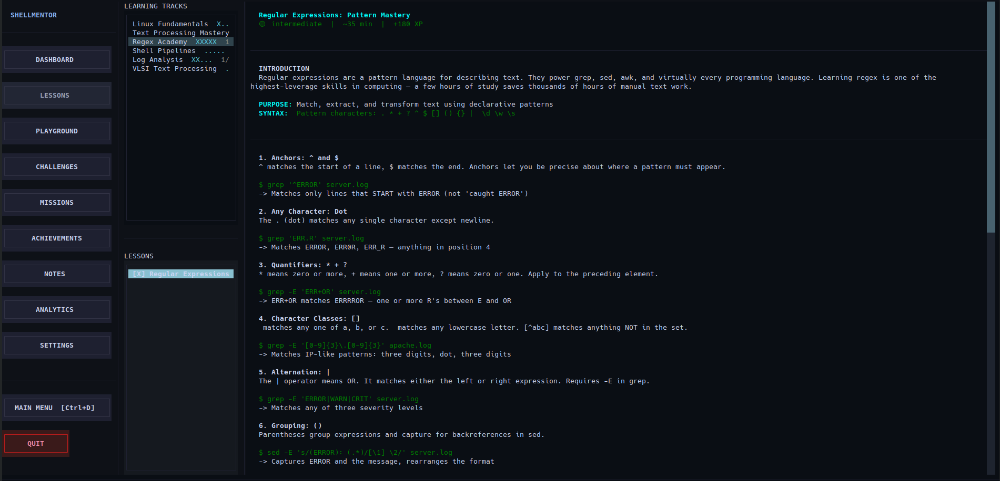
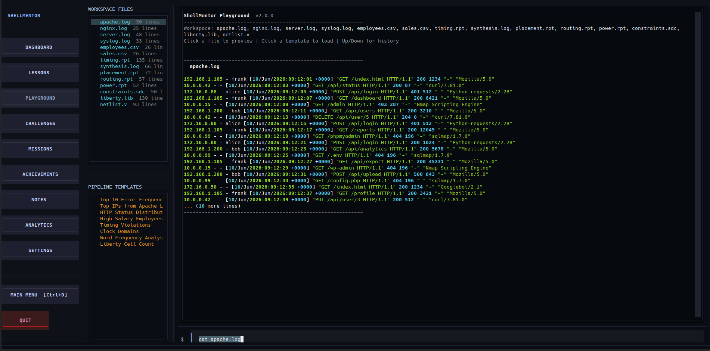
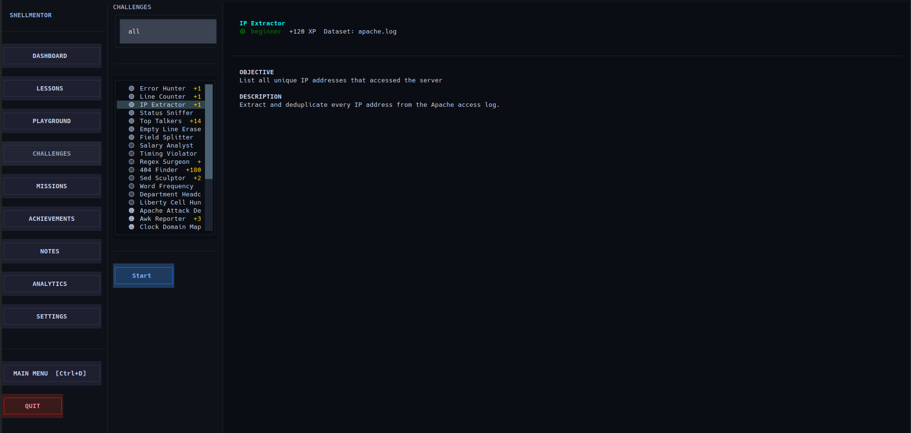
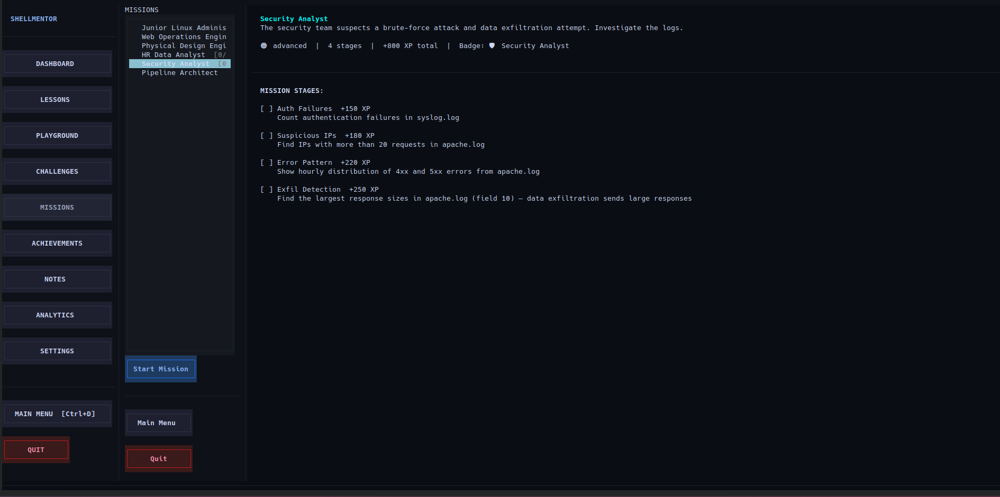
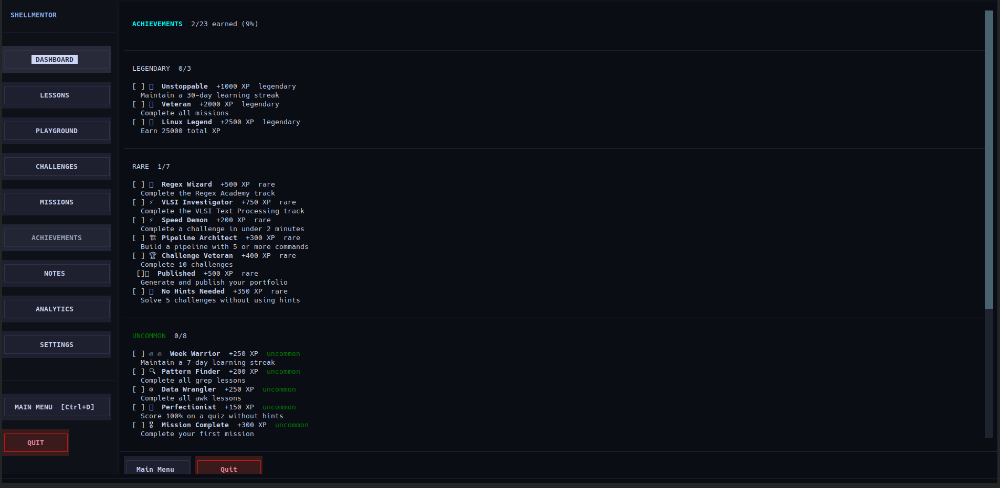
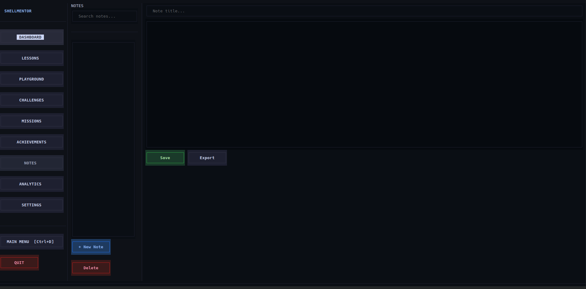
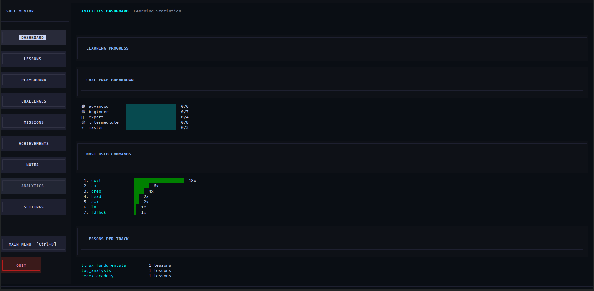
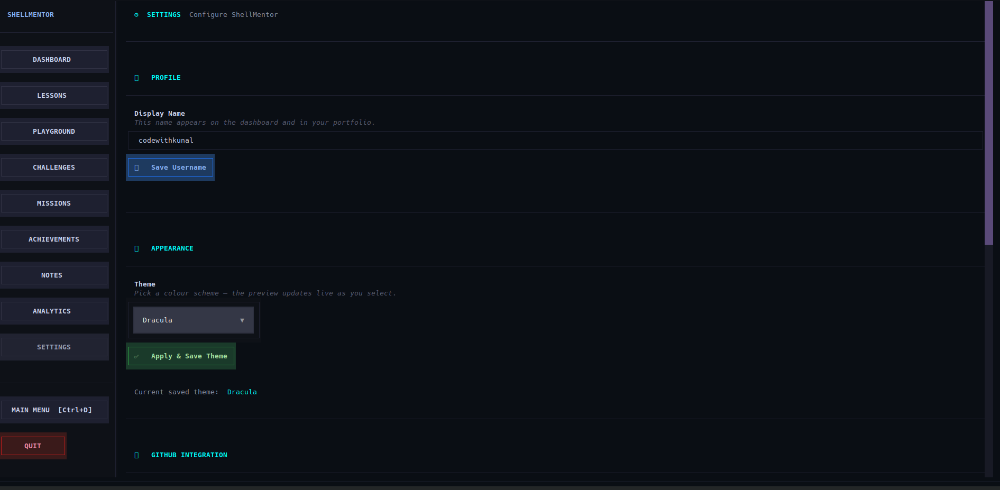

<div align="center">

# ShellMentor

**Learn the Linux command line by writing real commands — without ever running one.**

A terminal-native learning platform that teaches `grep`, `sed`, `awk`, pipelines and log
forensics through structured lessons, scored challenges, and multi-stage missions.
Your commands are validated against reference solutions, never executed against your system.

[](https://github.com/bitWithKunal/ShellMentor/actions/workflows/ci.yml)
[](https://www.python.org/)
[](https://github.com/Textualize/textual)
[](LICENSE)
[](CHANGELOG.md)
[](#why-nothing-executes)

**43 lessons · 14 tracks · 50 challenges · 10 missions · 31 achievements · 12 ranks · 7 themes**

</div>

---

## Table of Contents

- [What ShellMentor Is](#what-shellmentor-is)
- [Why Nothing Executes](#why-nothing-executes)
- [Screenshots](#screenshots)
- [Quick Start](#quick-start)
- [The Eight Modules](#the-eight-modules)
- [Curriculum](#curriculum)
- [Progression System](#progression-system)
- [Keyboard Reference](#keyboard-reference)
- [Architecture](#architecture)
- [Data & Storage](#data--storage)
- [Authoring Your Own Content](#authoring-your-own-content)
- [Programmatic API](#programmatic-api)
- [Development](#development)
- [Troubleshooting](#troubleshooting)
- [Contributing](#contributing)
- [Roadmap](#roadmap)
- [License & Credits](#license--credits)

---

## What ShellMentor Is

Most command-line tutorials are either passive reading or a live shell that punishes
mistakes. ShellMentor sits deliberately in between: you are given a **real dataset**, a
**real objective**, and a blank prompt — and your answer is graded on whether the
*command you wrote* is correct.

```
Objective:  Extract every unique IP address that returned a 500 error
Dataset:    workspace/nginx.log  (9.6 KB, 101 lines)

> awk '$9 == 500 {print $1}' nginx.log | sort -u
  ✓ Correct — matched reference solution        +250 XP   Level 3 → 4
```

**Who it's for**

| Audience | What they get out of it |
|---|---|
| Linux beginners | A safe path from `ls` to pipelines with no risk of breaking anything |
| DevOps / SRE | Log-forensics drills on real Apache, nginx, and syslog captures |
| Data analysts | CSV wrangling with `cut`, `awk`, `sort`, `join` on realistic HR and sales data |
| VLSI / EDA engineers | A dedicated track over `.lib`, `.sdc`, timing reports, and synthesis logs |
| Instructors | 43 authored lessons with quizzes and exercises, offline and self-hosted |

---

## Why Nothing Executes

This is the core design decision, not a limitation.

> ShellMentor contains **zero** calls to `subprocess`, `os.system`, `eval`, or `exec`.
> Nothing you type is ever handed to a shell.

```bash
# Verify it yourself:
grep -rn 'subprocess\|os\.system\|eval(\|exec(' --include='*.py' .
# (no results)
```

Submissions are validated structurally — a `pattern_match` check against the
challenge's reference solution (42 of 50 challenges), or a `line_count` assertion
(the remaining 8). That buys four things:

1. **Safety** — `rm -rf`, fork bombs, and `curl | sh` are inert text. Run it on a
   production jump host without a second thought.
2. **Portability** — grading does not depend on your GNU/BSD flavour, locale, or
   whether `rg` happens to be installed.
3. **Determinism** — the same answer always scores the same way, so progress and
   analytics actually mean something.
4. **Teaching leverage** — feedback targets *the command you wrote*, not just its
   output, so a right answer for the wrong reason gets caught.

The trade-off is honest and stated up front: ShellMentor teaches you to **compose**
commands correctly. Muscle memory for a live TTY still comes from a live TTY.

---

## Screenshots

> Captured from ShellMentor v4.4.0 on Linux.

<table>
<tr>
<td width="50%">

**Lessons** — structured curriculum with syntax-highlighted walkthroughs



</td>
<td width="50%">

**Command Lab** — workspace files, templates, and structural feedback



</td>
</tr>
<tr>
<td width="50%">

**Challenges** — 50 scored exercises across five difficulty tiers



</td>
<td width="50%">

**Missions** — multi-stage, role-framed workflows



</td>
</tr>
<tr>
<td width="50%">

**Achievements** — 31 badges across five rarity tiers



</td>
<td width="50%">

**Notes** — searchable in-app knowledge repository



</td>
</tr>
<tr>
<td width="50%">

**Analytics** — difficulty breakdowns and command frequency



</td>
<td width="50%">

**Settings** — profile, theme selection, and dependency scan



</td>
</tr>
</table>

---

## Quick Start

### Requirements

| | Minimum | Notes |
|---|---|---|
| Python | 3.10+ | Enforced at startup; 3.10–3.13 covered by CI |
| Terminal | 24-bit colour, 80×24 | 120×32 or larger strongly recommended |
| OS | Linux, macOS, WSL2 | Native Windows console is unsupported |
| Disk | ~15 MB | Plus a small SQLite database in your user data directory |

Dependencies are pinned with deliberate upper bounds — Textual has changed both its
markup parser and `Screen` internals across majors, and both breakages reached users:

```
textual >=1.0,<9     rich >=13.7,<16     pyyaml >=6.0.1,<7     platformdirs >=4.2.0,<5
```

### Install

<details open>
<summary><b>Option A — launcher script (recommended)</b></summary>

Creates the virtual environment, installs dependencies, and launches in one step.

```bash
git clone https://github.com/bitWithKunal/ShellMentor.git
cd ShellMentor
chmod +x shellmentor.sh
./shellmentor.sh
```

| Flag | Effect |
|---|---|
| `--install-only`, `-i` | Install dependencies and shell integration, then exit |
| `--update`, `-u` | Upgrade `textual`, `rich`, `pyyaml`, `platformdirs` |
| `--dev`, `-d` | Launch with system Python, skipping the virtual environment |
| `--version`, `-v` | Print version information |
| `--help`, `-h` | Show usage |

</details>

<details>
<summary><b>Option B — manual virtual environment</b></summary>

```bash
git clone https://github.com/bitWithKunal/ShellMentor.git
cd ShellMentor

python3 -m venv .venv
source .venv/bin/activate          # Windows/WSL2: source .venv/Scripts/activate

python -m pip install --upgrade pip
python -m pip install -r requirements.txt

python main.py
```

</details>

<details>
<summary><b>Option C — install as a package</b></summary>

```bash
python -m pip install .
python -m main
```

Built with `hatchling`. The project uses a flat layout, so `pyproject.toml` lists
wheel and sdist contents explicitly.

</details>

### Verify

```bash
python -m compileall -q .    # syntax across every module
python -m pytest -q          # 12 tests, including headless UI smoke tests
```

The smoke suite mounts **every screen** through Textual's headless pilot. This exists
because `compileall` alone cannot catch a `NameError` inside a screen body or a method
that shadows a Textual internal — both of which shipped as crashes before v4.4.0.

`main.py` takes no arguments; all options belong to `shellmentor.sh`.

### First five minutes

1. Launch — you land on the **Dashboard** with your rank, XP, and streak.
2. `Ctrl+L` → **Lessons** → *Linux Fundamentals* → lesson 1. Work the inline exercises;
   each one grants XP once.
3. Finish the lesson quiz. Question rewards vary — they are not a flat rate.
4. `Ctrl+G` → **Command Lab**. Pick a workspace file, preview it, try a template.
5. `Ctrl+H` → **Challenges** → any *beginner* entry. Solving without a hint feeds the
   hint-free counter behind several achievements.

---

## The Eight Modules

| | Module | Shortcut | What it does |
|---|---|---|---|
| 📚 | **Lessons** | `Ctrl+L` | 43 lessons across 14 tracks — theory, syntax, worked sections, common mistakes, best practices, exercises, and a closing quiz. Position is saved, so you can resume mid-lesson. |
| 🧪 | **Command Lab** | `Ctrl+G` | Free-form practice over 12 real workspace datasets. Autocomplete across 43 commands, pipeline templates, file previews, command history, session recording, and a diff viewer for comparing two attempts. |
| 🎯 | **Challenges** | `Ctrl+H` | 50 scored exercises — beginner (11), intermediate (13), advanced (11), expert (9), master (6). Progressive hints, a first-attempt bonus, and a timer. Failed attempts are recorded, so analytics reflect reality. |
| 🚀 | **Missions** | `Ctrl+M` | 10 role-framed scenarios of 4–5 stages each. Every stage is validated against its own reference solution before the next unlocks. |
| 🏆 | **Achievements** | `Ctrl+A` | 31 badges — common (5), uncommon (9), rare (12), epic (1), legendary (4). Every badge evaluates a real condition against your stats. |
| 📝 | **Notes** | `Ctrl+N` | Searchable personal notepad with export. Deliberately preserved across a progress reset. |
| 📊 | **Analytics** | `Ctrl+R` | Solve rates by difficulty, most-used commands, lessons per track, session time, and difficulty suggestions derived from your attempt history. |
| ⚙️ | **Settings** | `Ctrl+T` | Username, theme picker (7 themes), environment scan for optional CLI tools, portfolio export, and progress reset. |

Plus **Git Space** (`Ctrl+U`) — a guided reference for `init`, `status`, `add`,
`commit`, `push`, `pull`, and `log`, pointed at a repository path you choose. In keeping
with the execution model, it *displays* the commands for you to run in your own terminal
rather than running them.

---

## Curriculum

### Tracks

| # | Track | Lessons | Focus |
|---|---|---|---|
| 1 | 🐧 Linux Fundamentals | 4 | Navigation, file basics, the shell environment |
| 2 | 📝 Text Processing Mastery | 3 | `grep`, `cut`, `tr`, `sort`, `uniq` |
| 3 | 🔮 Regex Academy | 2 | BRE, ERE, capture groups, greedy vs lazy |
| 4 | 🔗 Shell Pipelines | 3 | Composition, redirection, `tee`, `xargs` |
| 5 | 📋 Log Analysis | 2 | Field extraction, frequency counts, time windows |
| 6 | ⚡ VLSI Text Processing | 1 | Liberty files, SDC constraints, timing reports |
| 7 | 📜 Shell Scripting | 3 | Variables, conditionals, loops, functions |
| 8 | 📁 File System & Permissions | 4 | `chmod`, `chown`, ownership models, `find` |
| 9 | ⚙️ Process Management | 4 | `ps`, signals, jobs, resource inspection |
| 10 | 🌐 Networking Fundamentals | 3 | Interfaces, ports, connectivity diagnosis |
| 11 | 🔄 Git & Version Control | 3 | Staging, history, branching |
| 12 | 👤 User & System Administration | 3 | Accounts, groups, system inspection |
| 13 | 🔬 Advanced Text Processing | 4 | `awk` programs, `sed` scripting, `join`, `comm` |
| 14 | 📊 Data Analysis Pipeline | 4 | End-to-end CSV → report workflows |

Each lesson carries an introduction, purpose, syntax reference, worked sections, a
*common mistakes* list, best practices, hands-on exercises, and a quiz — with tags,
a difficulty, an XP reward, and an estimated duration.

### Challenges

| Tier | Count | Character |
|---|---|---|
| Beginner | 11 | Single command, one flag |
| Intermediate | 13 | Two-to-three stage pipelines |
| Advanced | 11 | Multi-stage with field extraction and aggregation |
| Expert | 9 | Non-obvious tool choices, precise regex |
| Master | 6 | Full forensic workflows over messy real data |

**17,150 XP** is available across all 50. Coverage by track: text processing (16),
Linux fundamentals (13), log analysis (7), regex (6), VLSI (5), pipelines (3).

### Missions

| Mission | Difficulty | Stages | XP |
|---|---|---|---|
| 🛠️ Junior Linux Administrator | Beginner | 4 | 500 |
| 🔄 Version Control Specialist | Beginner | 4 | 500 |
| 👔 HR Data Analyst | Intermediate | 4 | 600 |
| 🌐 Web Operations Engineer | Intermediate | 5 | 700 |
| ⚙️ System Administration Pro | Intermediate | 5 | 700 |
| 📡 Network Troubleshooter | Intermediate | 5 | 750 |
| 🛡️ Security Analyst | Advanced | 4 | 800 |
| ⚡ Physical Design Engineer | Advanced | 5 | 900 |
| 📊 Data Pipeline Builder | Advanced | 5 | 900 |
| 🏗️ Pipeline Architect | Expert | 5 | 1200 |

### Workspace datasets

Every exercise runs against files that ship with the repository — no downloads, no
network, fully offline:

```
workspace/
├── timing.rpt       11.4 KB   Static timing analysis report
├── syslog.log       10.6 KB   System log with mixed facilities
├── nginx.log         9.6 KB   nginx access log
├── apache.log        8.2 KB   Apache combined access log
├── server.log        6.7 KB   Application server log
├── liberty.lib       6.3 KB   Liberty cell library
├── article.txt       3.9 KB   Prose for word-frequency work
├── synthesis.log     3.7 KB   EDA synthesis run output
├── employees.csv     2.5 KB   HR records
├── sales.csv         2.4 KB   Transaction data
├── constraints.sdc   2.3 KB   Synopsys Design Constraints
└── names.txt         0.7 KB   Small set for join/comm exercises
```

The Command Lab knows **43 commands**, including `grep`/`egrep`/`fgrep`, `sed`, `awk`/`gawk`,
`cut`, `sort`, `uniq`, `tr`, `wc`, `head`, `tail`, `tee`, `paste`, `join`, `comm`, `find`,
`xargs`, `column`, `nl`, `split`, `diff`, `cmp`, `base64`, `od`, `xxd`, `iconv`, `strings`,
plus modern replacements `rg`, `fd`, `bat`, and `jq`.

---

## Progression System

### Ranks

XP is cumulative and never decays. Twelve ranks span 0 → 50,000 XP:

| Level | Rank | XP | | Level | Rank | XP |
|---|---|---|---|---|---|---|
| 1 | 🌱 Terminal Novice | 0 | | 7 | ⚡ Pipeline Master | 10,000 |
| 2 | 🔰 Shell Apprentice | 500 | | 8 | 🔬 Log Investigator | 14,000 |
| 3 | 🎯 Pattern Hunter | 1,200 | | 9 | 🤖 Automation Expert | 19,000 |
| 4 | 🔮 Regex Apprentice | 2,500 | | 10 | 🏗️ Linux Architect | 25,000 |
| 5 | 📝 Text Wrangler | 4,500 | | 11 | 💎 VLSI Investigator | 32,000 |
| 6 | 🔗 Pipeline Builder | 7,000 | | 12 | 👑 ShellMentor Grandmaster | 50,000 |

### How XP is earned

| Source | Award |
|---|---|
| Lesson completion | Per-lesson reward, granted once |
| Lesson exercise | Per-exercise reward, granted once each |
| Quiz question | Each question's own reward — not a flat rate |
| Challenge solve | Tier reward, plus a first-attempt bonus |
| Mission stage | Per-stage reward |
| Mission completion | 500–1,200 depending on difficulty |
| Achievement unlock | 50–1,000 by rarity, routed through the normal XP path so a badge that triggers a level-up actually fires the level-up |

Repeat completions and re-solves do not inflate counters. Every achievement trigger
evaluates a real condition against your recorded stats — in earlier versions three were
hardcoded `true` and handed out roughly 1,000 XP on the very first award.

---

## Keyboard Reference

| Key | Action | | Key | Action |
|---|---|---|---|---|
| `Ctrl+P` | Command palette | | `Ctrl+A` | Achievements |
| `Ctrl+D` / `F1` | Dashboard | | `Ctrl+N` | Notes |
| `Ctrl+L` | Lessons | | `Ctrl+R` | Analytics |
| `Ctrl+G` | Command Lab | | `Ctrl+T` | Settings |
| `Ctrl+H` | Challenges | | `Ctrl+U` | Git Space |
| `Ctrl+M` | Missions | | `Ctrl+Q` | Quit |

`Esc` closes the command palette and every modal, and goes back one screen from any
content screen. Session time is flushed to the database on quit *and* on unmount, so a
clean exit never loses your minutes.

---

## Architecture

Three layers, strictly ordered. UI never touches SQL; engines never touch widgets.

```
┌──────────────────────────────────────────────────────────────────────┐
│  PRESENTATION                                        Textual widgets  │
│                                                                       │
│  main.py            App shell, global bindings, routing, XP events    │
│  ui_core.py         BaseScreen, LevelUp/Achievement/Hint/Confirm/     │
│                     Certificate modals                                │
│  ui_screens.py      Dashboard · Lessons · Quiz · Playground · Notes · │
│                     Analytics · Settings · EnvScan · Git Space        │
│  ui_activities.py   Challenges · Challenge · Missions · Mission ·     │
│                     Achievements                                      │
│  ui.py              Re-export surface for the screen modules          │
└────────────────────────────────┬─────────────────────────────────────┘
                                 │  engine calls · event callbacks
┌────────────────────────────────┴─────────────────────────────────────┐
│  DOMAIN                                              no UI imports    │
│                                                                       │
│  learning.py     LearningEngine    lesson flow, exercises, quizzes    │
│  challenge.py    ChallengeEngine   submission, hints, mission stages  │
│  playground.py   PlaygroundEngine  history, sessions, autocomplete,   │
│                                    templates, diff viewer             │
│  progress.py     ProgressEngine    XP, ranks, achievements, portfolio │
│  utils.py        shared types, SUPPORTED_COMMANDS, system probe       │
└────────────────────────────────┬─────────────────────────────────────┘
                                 │  DataManager API only
┌────────────────────────────────┴─────────────────────────────────────┐
│  PERSISTENCE                                                          │
│                                                                       │
│  data_manager.py   SQLite, 13 tables, schema migrations               │
│  data/*.json       lessons · challenges · missions · achievements     │
│  themes/*.yaml     7 themes: palette + Textual CSS                    │
│  workspace/*       12 curriculum datasets                             │
└──────────────────────────────────────────────────────────────────────┘
```

**Why it is shaped this way.** Engines are importable and testable without a terminal,
which is what makes the headless smoke suite possible. Content lives in JSON rather than
code, so adding a lesson requires no Python. Themes are data too — each is a palette plus
a Textual CSS block, so a new theme is a YAML entry.

### Module map

| File | Lines | Responsibility |
|---|---:|---|
| `ui_screens.py` | 1,871 | Nine screens: dashboard through Git Space |
| `data_manager.py` | 1,028 | SQLite access layer, schema, migrations, statistics |
| `ui_activities.py` | 856 | Challenge and mission runners, achievement gallery |
| `main.py` | 718 | Application shell, key bindings, screen routing, session timing |
| `playground.py` | 493 | Command Lab: history, sessions, templates, diffs |
| `learning.py` | 476 | Lesson sequencing, exercise and quiz grading |
| `utils.py` | 446 | Shared dataclasses, command registry, environment probe |
| `ui_core.py` | 423 | `BaseScreen` and the five shared modals |
| `challenge.py` | 388 | Challenge and mission-stage validation, hint ladder |
| `progress.py` | 321 | XP, level-ups, achievement evaluation, portfolio export |
| **Total** | **7,020** | Plus `ui.py`, the re-export surface |

---

## Data & Storage

### Where your data lives

State is stored in a per-user SQLite database resolved through `platformdirs` — never
inside the repository, so `git pull` can never clobber your progress:

| Platform | Path |
|---|---|
| Linux | `~/.local/share/ShellMentor/shellmentor.db` |
| macOS | `~/Library/Application Support/ShellMentor/shellmentor.db` |
| WSL2 | Follows the Linux path inside the distribution |

Delete that file to reset everything. **Settings → Reset All Progress** does the same
thing selectively — clearing XP, streak, hint-free count, and the portfolio flag while
deliberately preserving your notes.

### Schema

Thirteen tables, migrated forward on open:

| Table | Holds |
|---|---|
| `user` | Profile, username, creation time |
| `progress` | XP, level, streaks, aggregate counters |
| `lesson_history` | Completions, scores, resume positions |
| `challenge_history` | Attempts, solves, timings, `last_command` |
| `mission_history` | Stage rows and completions, distinguished by `is_final` |
| `achievements` | Unlocked badges with timestamps |
| `notes` | Personal notes |
| `sessions` | Command Lab session recordings |
| `command_history` | Every submitted command, powering analytics |
| `analytics` | Derived learning metrics |
| `bookmarks` | Saved lessons and challenges |
| `certificates` | Generated completion certificates |
| `meta` | Schema version and migration state |

Content JSON is read-only at runtime. Nothing in `data/` is written during a session.

---

## Authoring Your Own Content

Content is plain JSON — no Python required. Restart the app to pick up changes.

<details>
<summary><b>Add a lesson</b> — <code>data/lessons.json</code></summary>

Append to the `lessons` array of any track under `tracks`:

```json
{
  "id": "custom_awk_intro",
  "title": "AWK Field Extraction",
  "icon": "🔬",
  "difficulty": "intermediate",
  "xp_reward": 150,
  "estimated_minutes": 20,
  "tags": ["awk", "fields", "text-processing"],
  "introduction": "AWK reads input line by line and splits each into fields.",
  "purpose": "Extract and reshape columnar data without writing a script.",
  "syntax": "awk 'PATTERN { ACTION }' FILE",
  "sections": [
    {
      "heading": "Field variables",
      "body": "$1 is the first field, $NF the last, $0 the whole line.",
      "example": "awk '{print $1, $NF}' workspace/employees.csv"
    }
  ],
  "common_mistakes": [
    "Using $1 before setting -F on a comma-separated file"
  ],
  "best_practices": [
    "Prefer -F',' over manual splitting for CSV input"
  ],
  "exercises": [
    {
      "prompt": "Print the last field of every line in names.txt",
      "solution": "awk '{print $NF}' names.txt",
      "xp_reward": 25
    }
  ],
  "quiz": [
    {
      "question": "Which variable holds the field count?",
      "options": ["$NF", "NF", "$0", "FS"],
      "answer": 1,
      "xp_reward": 15
    }
  ]
}
```

To add a whole track, append an object with `id`, `name`, `icon`, `color`,
`description`, `order`, and `lessons` to `tracks`.

</details>

<details>
<summary><b>Add a challenge</b> — <code>data/challenges.json</code></summary>

```json
{
  "id": "custom_500_ips",
  "title": "Server Error Sources",
  "icon": "🎯",
  "difficulty": "advanced",
  "xp_reward": 350,
  "track": "log_analysis",
  "dataset": "nginx.log",
  "objective": "List every unique IP that received a 500 response.",
  "description": "The status code is field 9 in this log format.",
  "hints": [
    "awk can filter on a field before printing",
    "Compare $9 against the literal 500",
    "sort -u removes duplicates in one step"
  ],
  "expected_pattern": "awk.*\\$9.*500.*sort.*-u",
  "validation_type": "pattern_match",
  "solution": "awk '$9 == 500 {print $1}' nginx.log | sort -u",
  "tags": ["awk", "logs", "nginx"]
}
```

`validation_type` accepts `pattern_match` (regex against the submission) or
`line_count` (assert the number of result lines). Hints are revealed one at a time;
solving without any feeds the hint-free counter behind several achievements.

</details>

<details>
<summary><b>Add a mission</b> — <code>data/missions.json</code></summary>

Missions chain stages, each validated against its own reference solution before the
next unlocks:

```json
{
  "id": "custom_triage",
  "title": "Incident Triage",
  "icon": "🚨",
  "description": "Trace an outage from symptom to root cause.",
  "difficulty": "advanced",
  "xp_reward": 800,
  "badge": "incident_responder",
  "color": "#ef4444",
  "stages": [
    {
      "title": "Find the spike",
      "objective": "Count 5xx responses per hour",
      "dataset": "nginx.log",
      "solution": "awk '$9 ~ /^5/ {print $4}' nginx.log | cut -d: -f2 | sort | uniq -c",
      "xp_reward": 150
    }
  ]
}
```

</details>

<details>
<summary><b>Add a theme</b> — <code>themes/themes.yaml</code></summary>

Each theme is a palette plus a Textual CSS block:

```yaml
themes:
  my_theme:
    name: "My Theme"
    description: "Short description shown in Settings"
    base: dark
    colors:
      primary: "#00d4ff"
      secondary: "#0099cc"
      accent: "#ff6b35"
      success: "#10b981"
      warning: "#f59e0b"
      error: "#ef4444"
      surface: "#0d1117"
      surface2: "#161b22"
      surface3: "#21262d"
      border: "#30363d"
      text: "#e6edf3"
      text_muted: "#7d8590"
      text_dim: "#484f58"
      xp_color: "#ffd700"
    css: |
      Screen { background: #0d1117; color: #e6edf3; }
      Header { background: #161b22; color: #00d4ff; }
```

Ships with Professional Dark, Professional Light, Nord, Dracula, Matrix,
Solarized Dark, and Cyber.

</details>

> **One caveat when authoring:** Textual parses square brackets as markup. Status
> markers such as `[X]` or `[SOLVED]` vanish from rendered output if passed through a
> markup-enabled widget. Use plain glyphs in content strings.

---

## Programmatic API

Every engine works headlessly, without a terminal:

```python
from data_manager import DataManager
from progress import ProgressEngine
from challenge import ChallengeEngine

db = DataManager()                       # default path, or DataManager(Path("test.db"))
progress = ProgressEngine(db)
challenges = ChallengeEngine(db)

stats = progress.get_stats()
print(f"Level {stats['level']} · {stats['xp']} XP · {stats['challenges_solved']} solved")

rank = progress.get_next_rank_info()
print(f"Next: {rank['next_title']} — {rank['xp_needed']} XP to go "
      f"({rank['progress_pct']:.0f}% there)")

result = progress.award_xp(100, source="custom", label="External practice")
if result.get("leveled_up"):
    print(f"Level up → {result['new_level']}")

content, path = progress.generate_portfolio()   # Markdown skills portfolio
print(f"Portfolio written to {path}")

db.close()
```

Key surfaces:

| Class | Selected methods |
|---|---|
| `DataManager` | `get_user`, `get_progress`, `record_challenge_attempt`, `award_achievement`, `check_and_award_achievements`, `get_stats`, `close` |
| `ProgressEngine` | `award_xp`, `get_stats`, `get_next_rank_info`, `generate_portfolio`, `reset_progress` |
| `ChallengeEngine` | `submit_challenge`, `submit_mission_stage`, hint retrieval |
| `LearningEngine` | Lesson sequencing, exercise and quiz grading, resume state |
| `PlaygroundEngine` | `submit_command`, `new_session`, `replay_session`, `autocomplete`, `get_pipeline_templates`, `list_workspace_files`, `diff_outputs` |

`DataManager` accepts an explicit `db_path`, which is how the tests run against a
throwaway database instead of your real one.

---

## Development

```bash
git clone https://github.com/bitWithKunal/ShellMentor.git
cd ShellMentor
python3 -m venv .venv && source .venv/bin/activate
python -m pip install -r requirements.txt pytest

python -m compileall -q .    # catches syntax errors everywhere
python -m pytest -q          # 12 tests
python main.py               # run it
```

### Test layout

| File | Covers |
|---|---|
| `test_core.py` | Engine logic against a temporary database — XP, validation, persistence |
| `test_ui_smoke.py` | Mounts every screen through Textual's headless pilot |

The smoke tests are not optional decoration. Two of the crashes fixed in 4.4.0 —
a screen method that shadowed Textual's internal `Screen._update_timer`, and an
undefined name inside a render worker — were invisible to `compileall` and only
surfaced when a screen was actually mounted.

### CI

`.github/workflows/ci.yml` runs on every push and pull request to `main`, across
Python 3.10, 3.11, 3.12, and 3.13: compile → test → build the package. A tagged
`v*` push additionally triggers `release.yml`, which re-verifies and cuts a GitHub
release with generated notes.

### Conventions

- Engines must not import Textual. If a fix needs a widget, it belongs in a UI module.
- Content changes go in `data/*.json`, not in Python.
- Any bug fix that a headless mount could have caught should come with a smoke test.
- Dependency upper bounds exist for a reason — widen one only after re-testing the UI.

---

## Troubleshooting

<details>
<summary><b>Layout is broken or garbled</b></summary>

Your terminal is likely below 80×24 or lacks true-colour support.

```bash
tput cols; tput lines          # want ≥ 80 × 24, ideally 120 × 32
echo $COLORTERM                # want: truecolor
```

Known-good terminals: GNOME Terminal, Kitty, Alacritty, WezTerm, iTerm2, Windows
Terminal with WSL2.

</details>

<details>
<summary><b>Screen markers like [X] or [SOLVED] are missing</b></summary>

Fixed in 4.4.0 — Textual was parsing them as markup tags. Update to the latest version.
If you hit it in custom content you authored, use plain glyphs instead of bracketed text.

</details>

<details>
<summary><b>Analytics is blank or crashes on a fresh profile</b></summary>

Also fixed in 4.4.0: `AVG()` and `MIN()` return NULL with no solved challenges, and an
undefined name was killing the render worker before any widget mounted. Update, or solve
one challenge to populate the aggregates.

</details>

<details>
<summary><b>Progress looks wrong after upgrading</b></summary>

Several counters were incorrect before 4.4.0 — mission completions counted every stage,
three achievements were hardcoded to fire, and lesson scores always read 100%. The
schema migrates forward on open, but historical rows written by the buggy versions keep
their original values. For a clean slate, use **Settings → Reset All Progress** (notes
are preserved) or delete the database file.

</details>

<details>
<summary><b>Textual import or rendering errors</b></summary>

Almost always a version outside the supported range:

```bash
python -m pip install -r requirements.txt --force-reinstall
```

</details>

<details>
<summary><b>Optional tools reported missing</b></summary>

**Settings → Environment Scan** probes for `git`, `grep`, `sed`, `awk`, `gawk`, `rg`,
`fd`, `fzf`, `bat`, and `sqlite3`. None are required — ShellMentor never executes
commands. The scan exists so you know what's available in your own terminal when you
go practice for real.

</details>

---

## Contributing

Contributions are welcome. See [CONTRIBUTING.md](CONTRIBUTING.md) for the full guide and
[SECURITY.md](SECURITY.md) for reporting vulnerabilities.

```bash
git checkout -b feature/your-change
# make the change; add or update tests
python -m compileall -q . && python -m pytest -q
git commit -m "feat: describe the change"
git push origin feature/your-change
```

Then open a pull request describing what changed, why, and how you tested it.

**Especially valuable:**

| Area | Examples |
|---|---|
| Curriculum | New lessons, challenges, or missions — pure JSON, no Python needed |
| Datasets | Realistic logs and data files for `workspace/` |
| Tracks | Kubernetes, containers, systemd, cloud CLIs |
| Themes | A palette and CSS block in `themes/themes.yaml` |
| Tests | Anything that would have caught a real bug |
| Accessibility | Screen-reader behaviour, high-contrast palettes |

Every pull request must pass CI on all four supported Python versions.

---

## Roadmap

**Shipped in 4.4.0** — see [CHANGELOG.md](CHANGELOG.md) for the full list.

Every fix below was reproduced before it was changed.

- Fixed four crashes: the challenge screen, analytics rendering, analytics on a fresh
  profile, and the mission runner on an already-complete mission
- Corrected progression integrity: real achievement triggers, accurate mission counts,
  honest lesson scoring, working first-attempt bonuses, recorded failed attempts
- Fixed lesson resume, which had never worked — the position was written with an
  `UPDATE` against a row that only exists after completion
- Restored status markers eaten by Textual's markup parser
- Added a headless UI smoke suite, CI across Python 3.10–3.13, and a release workflow

**Under consideration**

- Spaced-repetition review queue for previously solved challenges
- Import/export of curriculum packs as a single file
- Additional tracks: containers, systemd, cloud CLIs
- Localisation of lesson content
- Optional opt-in sandboxed execution mode, isolated from the grading path

Ideas and requests belong in [Issues](https://github.com/bitWithKunal/ShellMentor/issues).

---

## License & Credits

Released under the [MIT License](LICENSE). Copyright © 2026 Kunal Saraswat.

**Built on**

- [Textual](https://github.com/Textualize/textual) — the terminal UI framework
- [Rich](https://github.com/Textualize/rich) — terminal rendering
- [PyYAML](https://github.com/yaml/pyyaml) — theme configuration
- [platformdirs](https://github.com/platformdirs/platformdirs) — cross-platform data paths

**Author** — Kunal Saraswat
· [GitHub](https://github.com/bitWithKunal)
· [LinkedIn](https://www.linkedin.com/in/kunalsaraswat/)
· [Issue tracker](https://github.com/bitWithKunal/ShellMentor/issues)

<details>
<summary>Citation</summary>

```bibtex
@software{shellmentor2026,
  title   = {ShellMentor: A Terminal-Native Linux Command-Line Learning Platform},
  author  = {Saraswat, Kunal},
  year    = {2026},
  url     = {https://github.com/bitWithKunal/ShellMentor},
  version = {4.4.0}
}
```

</details>

<div align="center">

---

**Master the command line by writing commands — safely.**

If ShellMentor helped you, a ⭐ on the repository is appreciated.

</div>
